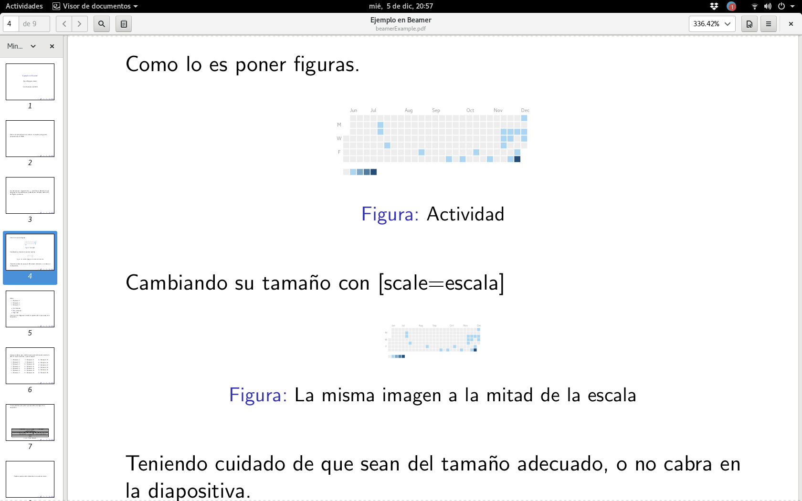

# Presentaciones en LaTeX con Beamer, un ejemplo



Como se menciono en la entrada anterior el paquete Beamer permite realizar 
presentaciones de diapositivas en LaTeX, ahora pues se mostrara el uso básico
de dicho paquete.

Para comenzar se detallaran los paquetes que se deben incluir para generar la 
diapositiva, en todo caso los paquetes a incluir se indican con la instrucción
*\usepackage*, estos son:

* **beamer**: El paquete principal, contiene las funciones que generan las diapositivas.
* **utf8** o **latin1**: Para poder escribir directamente los acentos y ñ en sistemas Linux o Windows respectivamente.
* **babel**: Con la opción spanish, con esto los texto generados por LaTeX (Figura, Bibliografía, etc) aparecerán en Español
* **hyperref**: Habilita los enlaces en el documento, de modo que al dar click en un numero de referencia, lo lleve a dicha referencia.
* **multicol**: Para presentar listas en multiples columnas
* **graphicx**: Para redimensionar tablas.

## Generación de las Diapositivas

El uso de paquete *Beamer* es muy sencillo, primero que nada debe especificar 
la clase de documento como beamer con ayuda del siguiente comando al inicio de
su documento.

```
\documentclass{beamer}
```

Con este el compilador de LaTeX ya sabra que estamos creando una presentación
de diapositivas y aceptara los comandos especificos a esta clase de documento,
los cuales se describiran a continuación.

## \titlepage
El comando *\titlepage* le permite generar la portada de su presentación, por 
defecto es solo muestra su nombre, el titulo de la presentación y la fecha, 
pero hay plantillas que pueden hacer la portada mas interesante.

Para especificar el titulo, autor y fecha debe usar los siguientes comandos:

```
\title{Titulo de la presentación}
\author{Nombre del autor}
\date{Fecha}
```

## \begin{frame} y \end{frame}
Los comandos *\begin{frame}* y *\end{frame}* delimitan una diaposiiva de
nuestra presentación, lo que coloque entre ambos comandos aparecera en una
pagina.

Una consideración que debe tomar es que la diapositiva no escala 
automaticamente el contenido, de modo que debe tener cuidado de no incluir
imagenes, listas o tablas que sean demasiado grandes para caber en la
diapositiva, no se preocupe hay comandos para encargarse de eso y veremos
algunos mas adelante.

## Agregando texto e imagenes a una diapositiva
Esto es muy simple basta con poner el texto entre los comandos *\begin{frame}*
y *\end{frame}* este aparecera en la diapositiva, se pueden aplicar todos los
comandos usuales para texto y generación de formulas.

Con respecto a las imagenes tambien se colocan como en un documento normal,
solo recuerde la limitación de tamaño, en el caso de que su imagen no quepa
puede usar el parametro *scale* para ajustar a un tamaño menor.

## Listas
De modo similar a las imagenes las listas se agregan como en un documento
normal y del mismo modo puede encontrarse con el problema de que no quepan
en su diapositiva, en este caso puede hacer uso de los comandos
*\begin{multicols}* y *\end{multicols}* para que su lista aparesca como
columnas y quepa mejor en la diapositiva, *\begin{multicols}* toma un
parametro que indica el numero de columnas que desea utilizar, como se ve
a continuación.

```
\begin{multicols}{3}
	\begin{enumerate}
		\item Elemento 1
		\item Elemento 2
		\item Elemento 3
    \end{enumerate}
\end{multicols}
```

En este caso el 3 es para indicar que deseamos repartir esa lista en 3
columnas.

## Tablas
Si tiene que agregar tablas a su presentación es casi seguro que el espacio
será un problema por lo que le recomiendo usar el comando *\resizebox* para
que todo quepa sin problemas, este comando toma dos argumentos el tamaño
para el ancho y para la altura de la tabla, como se ve en el siguiente
código.

```
\resizebox{10cm}{!} {
```

Donde el primer parametro controla el ancho al que desea redimensionar su
tabla y el segundo la altura que desea tenga la tabla, un ! indica que ese
parametro se eliga automaticamente para manter la proporción de la tabla en
base al otro parametro, solo uno de los parametros puede usar !.

## Referencias
Estas se agregan como de costumbre via los comandos *\label* y *\ref*

## Ejemplo
Para mostrar todo esto hagamos un ejemplo que combine todo, este muestra todo
lo que se presentó en esta entrada.

```
\documentclass{beamer}
\usepackage[utf8]{inputenc} % remplace utf8 con latin1
                            % si va a compilar en un sistema
                            % Windows
\usepackage{hyperref}
\usepackage[spanish]{babel}
\usepackage{multicol}
\usepackage{graphicx}

% Agregamos información del autor y titulo

\title{Ejemplo en Beamer}
\author{David Raygoza Gómez}
\date{5 de Diciembre del 2018}

\begin{document}

\begin{frame}
	\titlepage
\end{frame}

\begin{frame}
	Este es un ejemplo basico en beamer, el paquete para generar presentaciones en \LaTeX.
\end{frame}

\begin{frame}
	Las instruciones \emph{ \textbackslash begin\{frame\} } y \emph{\textbackslash  end\{frame\}} delimitan lo que aparecera en una diapositiva, podemos usar cualquier instrucción de \LaTeX sin problemas.
\end{frame}

\begin{frame}
	
	Como lo es poner figuras.
	
	\begin{figure}
		\includegraphics[scale=0.2]{imagenes/actividad.png}
		\caption{Actividad}
		\label{img_1}
	\end{figure}

	Cambiando su tamaño con [scale=escala]

	\begin{figure}
		\includegraphics[scale=0.1]{imagenes/actividad.png}
		\caption{La misma imagen a la mitad de la escala}
		\label{img_2}
	\end{figure}
	
	Teniendo cuidado de que sean del tamaño adecuado, o no cabra en la diapositiva.
	
\end{frame}

\begin{frame}
	Listas
	
	\begin{enumerate}
		\item Elemento 1
		\item Elemento 2
		\item Elemento 3
	\end{enumerate}

	\begin{itemize}
		\item Un elemento
		\item Otro elemento
		\item Algo mas
	\end{itemize}

	Como con las imagenes recuerde no pasarse de lo que quepa en la diapositiva,
	
\end{frame}

\begin{frame}
	Aunque podemos usar \emph{multicols} para automaticamente mostrar la lista en varias columnas y que asi quepan.

	\begin{multicols}{3}
		\begin{enumerate}
			\item Elemento 1
			\item Elemento 2
			\item Elemento 3
			\item Elemento 4
			\item Elemento 5
			\item Elemento 6
			\item Elemento 7
			\item Elemento 8
			\item Elemento 9
			\item Elemento 10
			\item Elemento 11
			\item Elemento 12
			\item Elemento 13
			\item Elemento 14
			\item Elemento 15
			\item Elemento 16
			\item Elemento 17
			\item Elemento 18
			\item Elemento 19
			\item Elemento 20
		\end{enumerate}
	\end{multicols}


\end{frame}

Y usar \emph{resizebox} para evitar que las tablas se salgan de la diapositiva.

\begin{table}
	\centering
	\resizebox{10cm}{!} {
	\begin{tabular}{|c|c|c|c|c|c|c|c|c|}
	\hline
	\multicolumn{5}{|c|}{Puerto fuente} & \multicolumn{4}{|c|}{Puerto destino} \\ \hline
	\multicolumn{9}{|c|}{Numero de secuencia} \\ \hline
	\multicolumn{9}{|c|}{Numero de reconocimiento} \\ \hline
	Longitud cabecera & Reservado & URG & ACK & PSH & RST & SYN & FIN & Tamaño ventana \\ \hline
	\multicolumn{5}{|c|}{Suma verificación} & \multicolumn{4}{|c|}{Puntero a datos urgentes} \\ \hline
	\multicolumn{9}{|c|}{Opciones} \\ \hline
	\multicolumn{9}{|c|}{Datos} \\ \hline
	\end{tabular}
	}
	\caption{Tabla Ejemplo.}
	\label{c2_tabla_segento_tcp}
	\end{table}

\begin{frame}
	\begin{center}
		Tambien puede centrar elementos con ayuda de \emph{center}
	\end{center}	
\end{frame}

\begin{frame}
	Y referencias figuras, como la Figura \ref{img_1} o a la tabla \ref{c2_tabla_segento_tcp} con ayuda de  \emph{\textbackslash ref}
\end{frame}

\end{document}
```

Espero que esta entrada le halla sido de utilidad.
